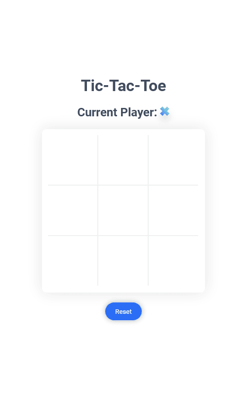

# React Tic-Tac-Toe

Just a simple Tic-Tac-Toe game using React. Inspired by [this Dribbble](https://dribbble.com/shots/4239811-Tic-Tac-Toe) by [Alexandru Dranga](https://dribbble.com/alexdranga).

## Live Demo:

[https://styleshit-tic-tac-toe.netlify.app/](https://styleshit-tic-tac-toe.netlify.app/)

## Screenshots:
|  |  |  |
|------------------------------------------------------|----------------------------------------------------------------------------|------------------------------------------|

